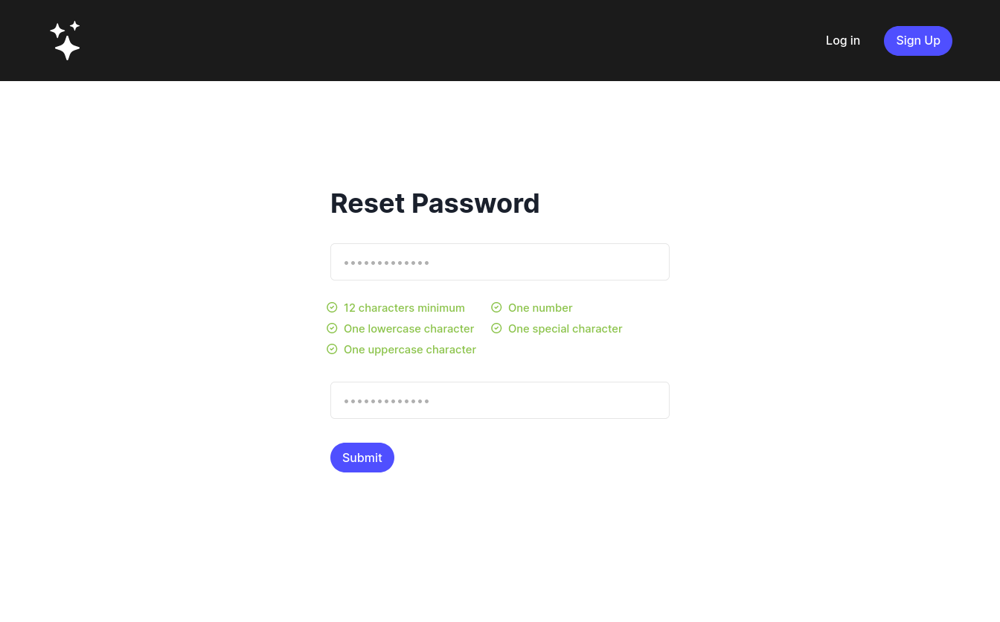

# Password reset app

Simple app that requires users to enter matching passwords meeting specific criteria to submit the form.

This project is based on a Figma design you can find in `/password-change.fig`.

## Set up and other instructions

This is a [Next.js](https://nextjs.org/) project bootstrapped with [`create-next-app`](https://github.com/vercel/next.js/tree/canary/packages/create-next-app).

To run the project: `npm install && npm run build && npm run start`

To run the tests: `npm run test`
